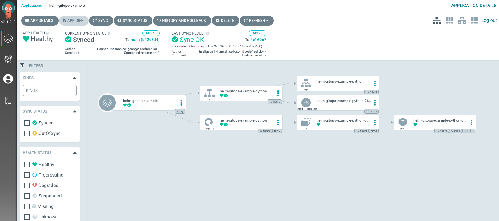

# Applied GitOps with Argo CD and Helm

This is a demo application including a Helm chart with GitOps. 

#### Prerequisites

- Access to a Kubernetes cluster
- Installing and configuring [Helm](https://helm.sh). Please refer to
Helm's [documentation](https://helm.sh/docs) to get started.

#### Helm commands

Once Helm has been set up correctly, add the repo as follows:

`helm repo add argo https://argoproj.github.io/argo-helm`

"argo" has been added to your repositories

`helm install my-release argo/argo-cd --namespace default`

Confirm the new release "my-release" has been created. This is done by executing helm list (or helm ls) function which will show you a list of all deployed releases:

`helm list --namespace foo`

If you need to uninstall this release:

`helm uninstall my-release`

Now that the Helm chart has been released, you can now deploy it with Argo CD.

#### Install Argo CD

First, you need to install Argo and in order to do this, please follow [this tutorial.](https://argoproj.github.io/argo-cd/getting_started/)

Once logged into Argo CD and accessed the UI, navigate to +NEW APP on the left hand side of the UI. Then add the following to create the application:

#### General:

- Application Name: helm-gitops-example
- Project: default
- Sync Policy: Automatic

#### Source:

- Repository URL/Git: this GitHub repository URL
- Branches: main
- Path: charts/python

#### Destinatin

- Cluster URL: select your cluster URL you are using
- Namespace: default

Then, click CREATE. You have now created your Argo application and it will read out all the parameters, and also read the source Kubernetes manifests. The application will be OutOfSync state since the application has yet to be deployed, and no Kubernetes resources have been created.

#### Synchronize the application manifests and deploy the Argo application

Initially the application is in OutOfSync state since the application has yet to be deployed, and no Kubernetes resources have been created. To synchronize/deploy the Argo app, choose the tile and then select SYNC. This will provide you options of what you want to synchronize.
Select the default options and synchronize all manifests. Once its deployed, you will see the resources deployed in the UI and a Healthy status.

#### Access the Argo application outside Kubernetes cluster

Within this application the values.yaml file is derived of parameters from which are the same path as the Helm chart. You can access this by clicking on your new application in the Argo UI and clicking on the PARAMETERS tab. Make sure your values.yaml file is chosen for the VALUES FILES field, this can be done by clicking EDIT and choosing the file within the field. Within the values.yaml includes the service port `5000` value inside the application configuration.

Since we're using the service type 'ClusterIP' within the values.yaml, execute the function to access the port:

`kubectl port-forward svc/helm-gitops-example 5000:80`

Point the browser to http://localhost:5000 and view the new Argo application.

#### Using the Argo CD CLI

Now that you've been able to view all the components within the Argo CD UI, like deployment, service, replicaset, pod - let's connect to Argo CD with the CLI.

Login using the CLI:

`argocd login localhost:8080 --username admin --password <same_password_used_in_ui>`

You might receieve an error about the server certificate, in this case it would be ok to proceed by typing "y". Argo CD generates it's own certificate and we can test that we are connected by listing our Argo apps:

`argocd app list`

You should now see the "helm-gitops-example" Argo application.

#### Application History

In case you need to rollback this application, Argo has similar capabilities as Helm in the sense that you can rollback the application to a previous deployed version by the History ID. First, you need access to the application deployment history:

`argocd app history helm-gitops-example`

The response should return the application history, including an ID, date, and branch that any revision was made on the application. You can then use the ID to rollback the application to a previous deployed version:

`argocd app history helm-gitops-example <application_history_id>`

Note: these same commands also be done with Helm, without Argo CD and the same steps can be executed for a non-Argo application.
