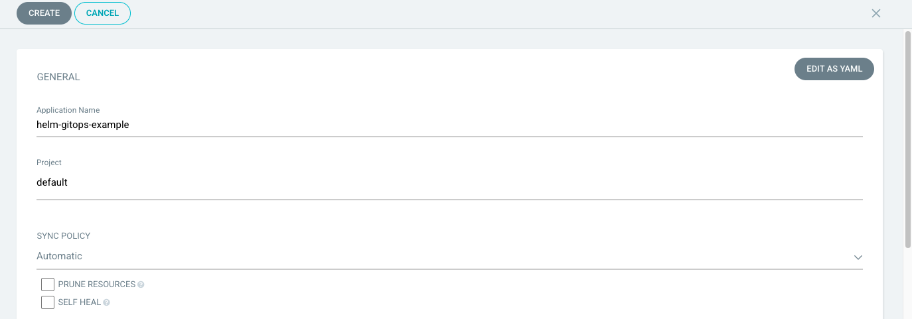

# Applied GitOps with Argo CD and Helm

This is an example application including a Helm chart. We'll explain 2 ways to install this application in the cluster and deploy using both Helm and Argo CD.

#### Prerequisites:

- Access to a Kubernetes cluster
- Install and configure [Helm](https://helm.sh). Please refer to Helm's [documentation](https://helm.sh/docs) to get started.
- Install and configure Argo CD. Please refer to Argo's [documentation](https://argoproj.github.io/argo-cd/getting_started/) to get started.

#### Part 1: Installing the application with Helm and deploy locally

We will install and deploy this application by using Helm. The Helm chart already exists within this application in the folder charts/python, so we don't need to create or add a chart. Start by cloning the repository to your local environment to get the files:

`git clone https://github.com/codefresh-contrib/helm-gitops-example`

After you create a cluster and have access to it, this application's structure includes:
- /charts/python: The Helm chart used to deploy the application.

Then, install the app as a Helm chart:

`cd helm-gitops-example/charts`

`helm install helm-demo ./python/ --namespace default`

You should see a similar output:

```NAME: helm-demo
LAST DEPLOYED: Fri Sep 17 12:41:31 2021
NAMESPACE: default
STATUS: deployed
REVISION: 1
TEST SUITE: None
NOTES:
```

The chart install performs the Kubernetes deployment and service creation of the application. The chart is essentially a collection of files used to describe a set of Kubernetes resources and Helm manages the creation of these resources. In order to confirm the deployment, execute the following:

`helm list --namespace default`

This will show you a list of all deployed releases. If you need to uninstall this release:

`helm uninstall helm-demo`

Now that the Helm chart has been released, you can execute rollbacks incase there are any issues. First, run the history command to identify a revision ID:

`helm history helm-demo`

Next, to execute a rollback, you can execute the command:

`helm rollback helm-demo <revision_id>`

Now, let's access the application by using a port-forward command to a local port:

`kubectl port-forward svc/helm-gitops-example 5000:80` then point the browser to http://localhost:5000 and view the application.

Congrats! You have now installed and deployed an application using Helm.

#### Part 2: Installing the application with the Argo CD UI and deploy locally

Now, that you've installed and deployed the application with Helm, let's review how to do the same with Argo CD. Assuming you've installed and configured Argo CD already, you can now log into Argo CD and access the UI. 

First, navigate to +NEW APP on the left-hand side of the UI. Then add the following to create the application:

#### General:

- Application Name: helm-gitops-example
- Project: default
- Sync Policy: Automatic



#### Source:

- Repository URL/Git: this GitHub repository URL
- Branches: main
- Path: charts/python


#### Destination

- Cluster URL: select the cluster URL you are using
- Namespace: default


Then, click CREATE. You have now created your Argo application and it will read out all the parameters, and also read the source Kubernetes manifests. The application will be OutOfSync state since the application has yet to be deployed, and no Kubernetes resources have been created.

#### Synchronize the application manifests and deploy the Argo application

Initially, the application is in OutOfSync state since the application has yet to be deployed, and no Kubernetes resources have been created. To synchronize/deploy the Argo app, choose the tile and then select SYNC. This will provide you options of what you want to synchronize.
Select the default options and synchronize all manifests. Once it's deployed, you will see the resources deployed in the UI and a Healthy status.

#### Access the Argo application outside the Kubernetes cluster

Within this application the values.yaml file is derived of parameters from which are the same path as the Helm chart. You can access this by clicking on your new application in the Argo UI and clicking on the PARAMETERS tab. Make sure your values.yaml file is chosen for the VALUES FILES field, this can be done by clicking EDIT and choosing the file within the field. Within the values.yaml includes the service port `5000` value inside the application configuration.

Since we're using the service type 'ClusterIP' within the values.yaml, execute the function to access the port:

`kubectl port-forward svc/helm-gitops-example 5000:80`

Point the browser to http://localhost:5000 and view the new Argo application.


#### Using the Argo CD CLI

Now that you've been able to view all the components within the Argo CD UI, like deployment, service, replica set, pod - let's connect to Argo CD with the CLI.

Log in using the CLI:

`argocd login localhost:8080 --username admin --password <same_password_used_in_ui>`

You might receive an error about the server certificate, in this case, it would be ok to proceed by typing "y". Argo CD generates its own certificate and we can test that we are connected by listing our Argo apps:

`argocd app list`

You should now see the "helm-gitops-example" Argo application.

#### Application History

In case you need to rollback this application, Argo has similar capabilities as Helm in the sense that you can rollback the application to a previously deployed version by the History ID. First, you need access to the application deployment history:

`argocd app history helm-gitops-example`

The response should return the application history, including an ID, date, and branch that any revision was made on the application. You can then use the ID to rollback the application to a specific deployed version:

`argocd app history helm-gitops-example <application_history_id>`

### Summary

Within this example you have used two different methods to install and deploy an application to a cluster using both Helm and Argo CD locally.
